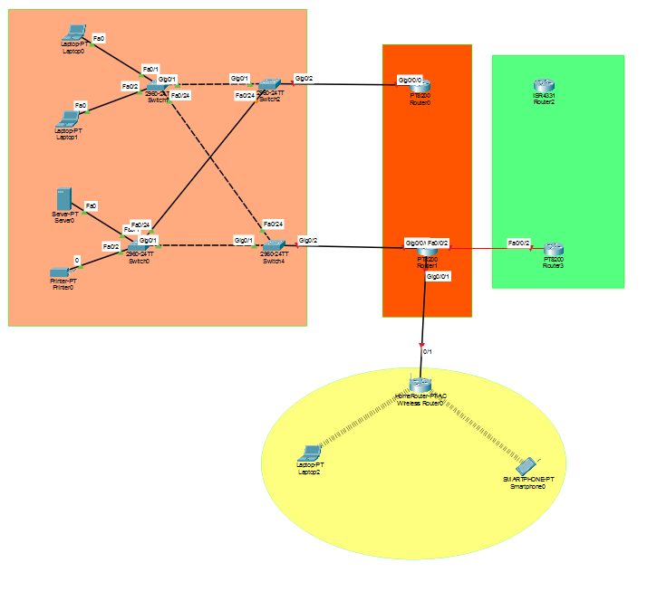

# Basic Router and 2 PC Lab
This is a basic networking lab created using Packet Tracer. Here, 1 router and 2 PCs on different subnets are connected.
## Device used:
- 1x Router (2911)
- 2x PCs

## IP configuration:
- **PC-0:** 192.168.1.2 (Gateway: 192.168.1.1)
- **PC-1:** 192.168.2.2 (Gateway: 192.168.2.1)

## Network topologyি:

